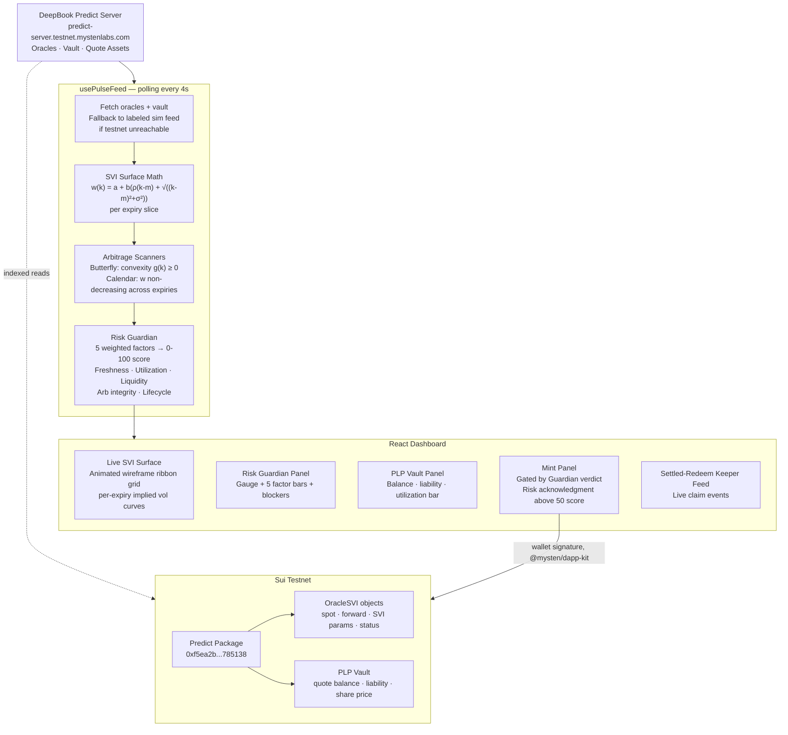

# PULSE
### The Risk-Aware Trading Terminal for DeepBook Predict


> **Every strike. Every expiry. One surface you can trust.**

Prediction markets price risk in dimensions most users never see. A strike's implied volatility, an oracle's staleness, a vault's exposure to its own liabilities — these numbers decide whether a mint is safe, but they live buried in raw SVI parameters and RPC calls nobody reads before signing.

PULSE makes them visible, makes them gate the trade, and proves the system is still running even when no one's watching.

Not a trading bot. Not a chart. A risk cockpit for DeepBook Predict.

---

## Live Deployment

| Resource | Link |
|---|---|
| **Live App** | _add your Vercel URL after deploy_ |
| **GitHub** | https://github.com/0xkinno/pulse |
| **DeepBook Predict Package** | [View on Suiscan](https://suiscan.xyz/testnet/object/0xf5ea2b3749c65d6e56507cc35388719aadb28f9cab873696a2f8687f5c785138) |
| **Network** | Sui Testnet |
| **Submission** | _add your DeepSurge submission link_ |

---

## The Problem

Three things make DeepBook Predict harder to trade safely than it needs to be.

**1. The volatility surface is invisible.** `OracleSVI` streams `a, b, rho, m, sigma` per expiry — real, tradeable information — but no interface turns that into something a trader can actually look at and reason about before minting.

**2. Risk is binary, not legible.** A transaction either reverts or it doesn't. There's no in-between signal that says "this oracle is getting stale" or "the vault is close to its exposure cap" until the moment it's too late to act on it.

**3. No-arbitrage isn't monitored.** Butterfly and calendar arbitrage in a mispriced or lagging surface are the kind of thing a quant desk checks constantly and a retail UI checks never.

PULSE is built as the direct answer to all three.

---

## The Solution

```
┌──────────────────────────────────────────────────────────────────────────────┐
│                              PULSE PIPELINE                                  │
├────────────┬────────────┬────────────┬────────────┬──────────────────────────┤
│  STREAM    │  COMPUTE   │  GUARD     │  TRADE     │  PROVE                   │
├────────────┼────────────┼────────────┼────────────┼──────────────────────────┤
│ DeepBook   │ Raw SVI    │ 5-factor   │ Mint gated │ Settled-Redeem Keeper    │
│ Predict    │ surface    │ deterministic│ behind   │ feed shows real claims   │
│ testnet    │ math +     │ risk score │ Guardian   │ happening — system is    │
│ server +   │ arb scans  │ + hard     │ verdict    │ alive, not a mockup      │
│ oracle     │ (butterfly │ blockers   │            │                          │
│ events     │ /calendar) │            │            │                          │
└────────────┴────────────┴────────────┴────────────┴──────────────────────────┘
```

The core idea: **risk is computed once, in one deterministic place, and every surface in the UI — the chart color, the gauge, the mint button — reads from that same number.** Nothing is restyled per-screen; nothing can disagree with itself.

---

## Architecture



---

## DeepBook Predict — the protocol PULSE sits on

PULSE doesn't deploy its own contracts — it's a risk-aware terminal built directly on the DeepBook Predict primitives, integrated the way the protocol's own docs recommend: indexed server reads for rendering, direct object reads around wallet flows, live events for freshness.

```
PredictManager (shared, reused per user)
  └── Holds quote balances, positions, range quantities

OracleSVI (per expiry)
  └── spot, forward, SVI params (a, b, ρ, m, σ), lifecycle status
  └── PULSE watches: OraclePricesUpdated · OracleSVIUpdated · OracleSettled · OracleActivated

Vault + PLP
  └── LPs supply quote assets → mint PLP shares
  └── PULSE tracks: balance, total liability, utilization %, share price
  └── Exposure cap mirrored client-side at 78% — same number the Guardian gates on
```

PULSE's Risk Guardian is a frontend mirror of the checks the protocol itself would need to enforce on-chain before a mint — freshness, exposure, and surface integrity — surfaced as one legible number instead of a revert.

---

## The Dashboard

### Live SVI Volatility Surface
The centerpiece. A hand-built SVG wireframe ribbon grid — not a charting library — rendering one ribbon per expiry, each point computed live from `w(k) = a + b(ρ(k-m) + √((k-m)²+σ²))` and converted to annualized implied vol. Pulses gently with each tick; switches from cyan to amber the moment an arbitrage violation is detected anywhere on the surface.

### Risk Guardian Panel
A single 0-100 score built from five weighted, fully deterministic factors — oracle freshness, vault utilization, liquidity depth, surface arb integrity, oracle lifecycle state — each with its own bar, detail line, and color. Hard blockers (stale oracle, exposure cap reached, oracle settled) are listed explicitly, not buried in a revert message.

### Mint Panel
Direction, amount, and oracle selection for binary positions — gated by the Guardian's verdict. Scores above 50 require an explicit risk acknowledgment checkbox before the mint button activates at all. Blocked states say exactly why.

### PLP Vault Panel
Balance, total liability, max payout coverage, and PLP share price, with a utilization bar that marks the 78% exposure cap as a visible line, not a hidden number.

### Settled-Redeem Keeper Feed
A live stream of claim events — manager, oracle, payout, tip, tx digest — proving the system keeps running unattended. This is the proof-of-life layer: on a quiet testnet, it's the difference between a static mockup and something that visibly works.

---

## Risk Guardian — Factor Weights

| Factor | Weight | Trigger for hard block |
|---|---|---|
| Oracle freshness | 25% | Stale beyond 2× the 90s threshold |
| Vault utilization | 20% | ≥ 78% of max exposure |
| Liquidity depth | 20% | — (contributes to score only) |
| Surface arb integrity | 20% | — (contributes to score only) |
| Oracle lifecycle | 15% | Oracle settled or inactive |

All five factors and their thresholds live in one file (`src/lib/constants.ts` + `src/lib/riskGuardian.ts`) — there is exactly one place that decides what "risky" means, and every panel in the UI reads from it.

---

## What's live vs. simulated right now

PULSE is built so a judge can tell the difference at a glance — every data source carries a `live` flag straight through to the UI (the ticker tape literally says `LIVE · TESTNET` or `SIMULATED FEED`).

| Piece | Status |
|---|---|
| SVI math, arbitrage scanners, Risk Guardian scoring | **Real** — computed live off whatever oracle params are on screen, testnet or simulated |
| Oracle + vault data | **Live when the testnet server responds**, falls back to a clearly-labeled simulated feed otherwise (expected without funded dUSDC) |
| Wallet connect | **Real** — `@mysten/dapp-kit`, signs with an actual Sui wallet |
| Mint/redeem execution | **Stubbed** — the Guardian gating is fully wired, the PTB call to `predict::mint` is the next piece to land |
| Settled-Redeem Keeper feed | **Simulated** — demonstrates the proof-of-life pattern a real off-chain keeper would follow |

---

## Tech Stack

| Layer | Technology |
|---|---|
| Framework | React 18, TypeScript, Vite |
| Sui integration | `@mysten/dapp-kit`, `@mysten/sui` (JSON-RPC client) |
| Data fetching | `@tanstack/react-query` |
| Surface rendering | Hand-built SVG (no charting library) |
| Styling | Hand-written CSS, design tokens, no UI framework |
| Deployment | Vercel |

---

## Protocol Integration Targets (Testnet)

| Parameter | Value |
|---|---|
| Network | Sui Testnet |
| Public server | `https://predict-server.testnet.mystenlabs.com` |
| Predict package | `0xf5ea2b3749c65d6e56507cc35388719aadb28f9cab873696a2f8687f5c785138` |
| Predict registry | `0x43af14fed5480c20ff77e2263d5f794c35b9fab7e2212903127062f4fe2a6e64` |
| Predict object | `0xc8736204d12f0a7277c86388a68bf8a194b0a14c5538ad13f22cbd8e2a38028a` |
| Quote asset | dUSDC |
| Source branch | `predict-testnet-4-16` |

These are provisional per Mysten Labs' own docs and will change at Mainnet launch — PULSE reads them from a single `constants.ts` file for exactly that reason.

---

## Running Locally

```bash
git clone https://github.com/0xkinno/pulse
cd pulse
npm ci
npm run dev
# open http://localhost:5173
```

No `.env` required to demo — the simulated feed activates automatically if the testnet server is unreachable or rate-limited.

---

## Verify the data source yourself

No frontend required — query the same public server PULSE reads from:

```bash
curl https://predict-server.testnet.mystenlabs.com/predicts/0xc8736204d12f0a7277c86388a68bf8a194b0a14c5538ad13f22cbd8e2a38028a/state
```

If that returns live data, PULSE's ticker tape will say `LIVE · TESTNET`. If it doesn't, PULSE falls back honestly — it never fakes the live badge.

---

## Project Structure

```
pulse/
├── src/
│   ├── lib/
│   │   ├── constants.ts        Testnet package IDs, risk thresholds
│   │   ├── svi.ts              SVI surface math + arb scanners
│   │   ├── riskGuardian.ts     5-factor deterministic risk scoring
│   │   └── predictApi.ts       Server fetch + simulated feed fallback
│   ├── hooks/
│   │   ├── usePulseFeed.ts     Polls server, runs math, builds risk state
│   │   └── useKeeperFeed.ts    Simulated settled-redeem event stream
│   ├── components/
│   │   ├── SurfaceViz.tsx      Live SVI wireframe ribbon grid
│   │   ├── RiskGuardianPanel.tsx
│   │   ├── VaultPanel.tsx
│   │   ├── TradePanel.tsx
│   │   ├── KeeperFeedPanel.tsx
│   │   ├── TickerTape.tsx
│   │   ├── WalletConnectButton.tsx
│   │   └── SuiProviders.tsx    dapp-kit + react-query setup
│   ├── styles/pulse.css        Electric cyan/amber design system
│   └── App.tsx
├── package.json
└── README.md
```

---

## Business Potential

Every protocol building a structured-product or prediction-market UI on Sui hits the same wall PULSE solves: raw oracle and vault state isn't legible to end users by default. The Risk Guardian pattern — one deterministic score, five inspectable factors, hard blockers stated in plain language — generalizes past DeepBook Predict to any oracle-driven Move protocol.

**Post-hackathon roadmap:**

1. **Live mint/redeem** — wire the Guardian-gated PTB calls against `predict::mint` / `predict::redeem`
2. **Real keeper service** — replace the simulated feed with an off-chain worker watching `oracle::OracleSettled` and calling redeem on behalf of managers, earning the tip
3. **Time-travel scrubber** — replay the surface using `/oracles/:id/svi` history
4. **Guardian-as-a-library** — extract the risk scoring engine for other Sui oracle-driven protocols to embed directly

---

## Hackathon Track

**Primary:** DeepBook — Sui Overflow 2026

**Why PULSE fits the track directly:**

- **Functional, working system** — live SVI math, real arbitrage detection, deterministic risk gating, all computed in the browser against real protocol parameters
- **Genuine use case** — every DeepBook Predict trader benefits from seeing surface risk before they mint, not after a revert
- **Technical depth** — raw SVI parameterization, numerically-differentiated convexity checks, and calendar arbitrage scanning are real quant-desk techniques, not decoration
- **Honest demo** — every data source is labeled live or simulated in the UI itself; nothing is silently faked

---

Built for Sui Overflow 2026 · DeepBook track

*See the surface. Trust the trade.*
